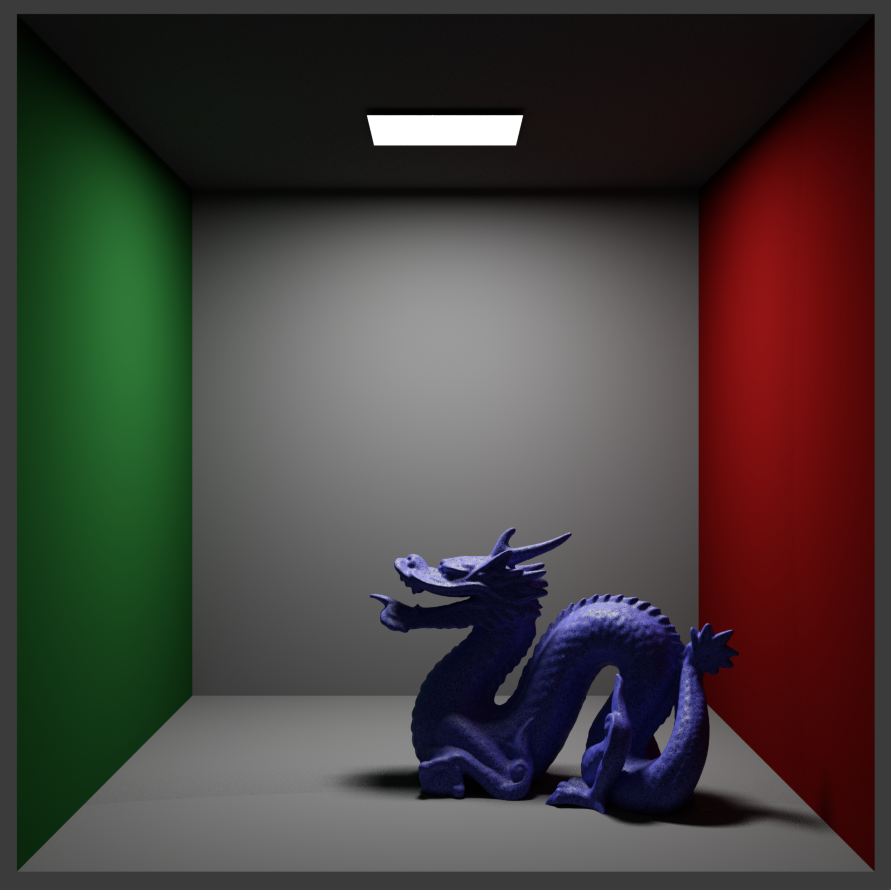
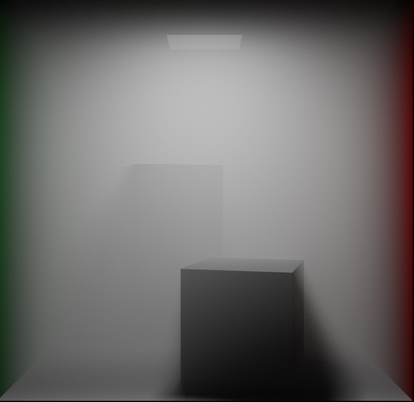

# HoRenderer-CPU

A physically based offline renderer with supports for path tracing, volume rendering, and multiple material types.

## Main Features

🎯 **Core Rendering Features**

Path Tracing Integrator  
Volume Rendering  
Multiple Importance Sampling  
BVH Accelerator  
Multi-Threaded Rendering

🎨 **Material System**

Diffuse  
Conductor  
Plastic  
Emission  
FrostedGlass

🔺 **Geometry Support**

Base Geometries: Sphere, Quad, Cube  
Transformations  
Normal Maps 

💡 **Lighting System**

Area Light: Quad area light  
Spherical Light: Spherical area light  
Ambient Light: Supports HDR environment maps

🌫️ **Volume Rendering**

Homogeneous Media  
Heterogeneous Media  
Phase Functions  
Multiple Scattering 

🎲 **Sampling System**

Sobol Sequence  
Importance Sampling  
Filters: Uniform, Gaussian, and Tent filters

🖼️ **Texture System**

Solid Color Textures  
Image Textures  
HDR Textures

📷 **Camera System**

Perspective Camera  
Depth of Field

📝 **TODO List**
 
Spectrum Sampling ❎

## Requirements📝

**Language:** C++23  
**Project Builder:** Xmake  
**Mathematical Library:** GLM  
**Window Manager:** GLFW  
**Graphics API:** OpenGL (GLAD)  
**Parallel Computing:** OpenMP  
**JSON Parser:** nlohmann_json (optional)  
**Ray Tracing Accelerator:** Embree (optional)

## Quick Start

Make sure that you have installed Xmake before running the project.

```
# Clone the repository
git clone https://github.com/yourusername/HoRenderer-CPU.git
cd HoRenderer-CPU

# Configure Project
xmake f -m release

# Compile
xmake

# Run the default Cornell Box scene
xmake run HoRenderer
```


## Gallery






## 📚 References

- [Ray Tracing in One Weekend Book Series](https://github.com/RayTracing/raytracing.github.io/tree/release)
- [DreamRender](https://github.com/GraphicsEnthusiast/DreamRender/tree/stage-3)
- [UCSD CSE 272: Advanced Image Synthesis (Winter 2024)](https://cseweb.ucsd.edu/~tzli/cse272/wi2024/)

